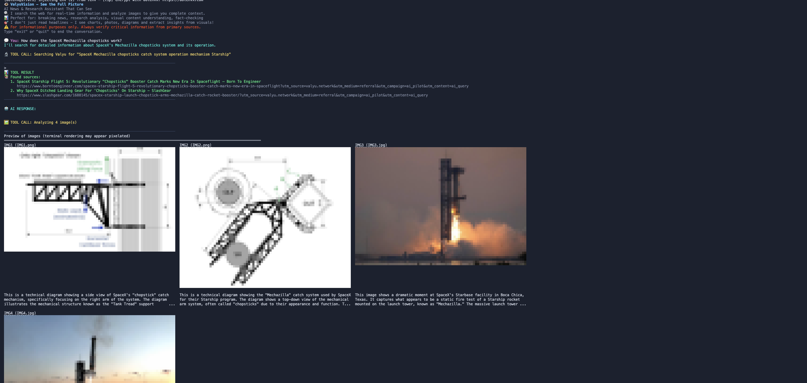
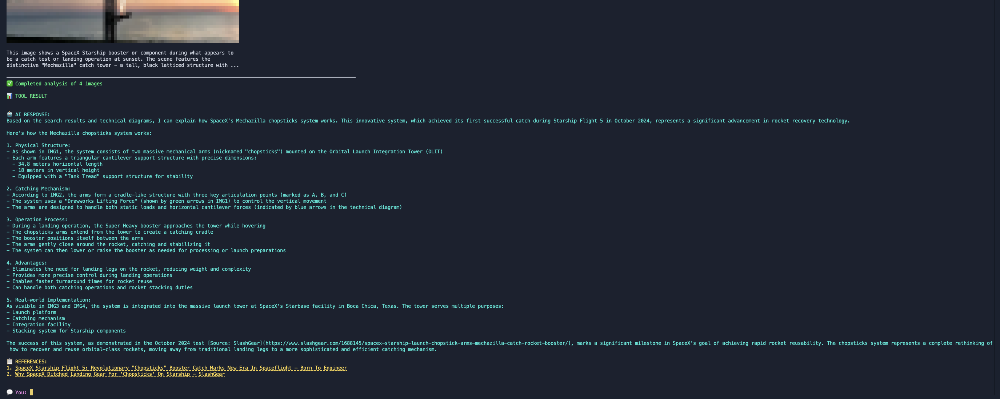

# The Oracle – See the Full Picture

> **The First AI Agent That Truly Sees The Web, Right From Your Terminal**: Goes beyond reading headlines to analyze charts, photos, diagrams, and visual content. Get real-time news analysis with complete visual context that other AI assistants miss.

An intelligent news and research assistant that doesn't just read text - it sees and understands images, charts, infographics, and visual content from across the web. Perfect for breaking news analysis, research deep-dives, fact-checking with visual evidence, and understanding complex topics through both text and imagery.

## 🚀 Getting Started — Just **2 API keys** and You're Good to Go!

1. **Clone & install**

```bash
git clone https://github.com/yorkeccak/the-oracle.git
cd the-oracle
npm install
```

2. **Add your 2 API keys to a `.env` file**

```bash
# Required
VALYU_API_KEY=your_valyu_api_key_here

# Choose ONE LLM provider
ANTHROPIC_API_KEY=your_anthropic_api_key_here
# or
OPENAI_API_KEY=your_openai_api_key_here
```

3. **Run it**

```bash
npm run start
```

## What Makes This Powerful

- 👁️ **Vision-Enhanced Reasoning** — Understands charts, photos & diagrams alongside text.
- ⚡ **Live Web Search** — Pulls up-to-the-minute info and images, then grounds every claim with clickable citations.
- 💻 **Terminal-Native UX** — Runs completely in your shell; no browser, no heavy setup.
- 🔍 **Source-Aware Answers** — Traces each insight back to the original article, dataset, or image for instant fact-checking.
- 🔧 **Hackable & Open-Source** — Built on @aisdk; extend tools, swap models, and make it your own.


## Try These Demo Questions

- "How does the SpaceX mechazilla chopsticks work?" (analyzes photos and technical diagrams)
- "Teach me about the history of the Faroe Islands" (analyzes maps, photos, and charts)
- "What is happening with the Elon Trump feud?" (analyzes photos and charts)
- "Analyze the recent stock market trends" (analyzes charts)
- "What does Bhutan look like?" (analyzes maps)

Type `exit` or `quit` to end the conversation.

## How It Works

1. **Ask About Current Events**: The assistant searches the web for the latest information on your topic
2. **Visual Intelligence**: Automatically finds and analyzes relevant images, charts, graphs, and infographics
3. **Complete Picture**: You get both textual analysis AND visual insights that other AI assistants miss
4. **Real-Time Context**: See breaking news through both articles and the visual evidence that accompanies them

**What sets this apart**: While other AI assistants are limited to text-only responses from training data, The Oracle actively searches the current web AND analyzes visual content in real-time. See financial charts, news photos, scientific diagrams, maps, and infographics – not just text summaries.

**Perfect for**: journalists, researchers, analysts, students, and anyone who needs to understand current events and complex topics through both text and visual evidence.

## What it looks like





## Important Disclaimer

⚠️ The Oracle provides real-time information and visual analysis for informational purposes only. Always verify critical information through primary sources and consult relevant experts for professional advice. Visual analysis is AI-generated and should be independently verified for important decisions.

---